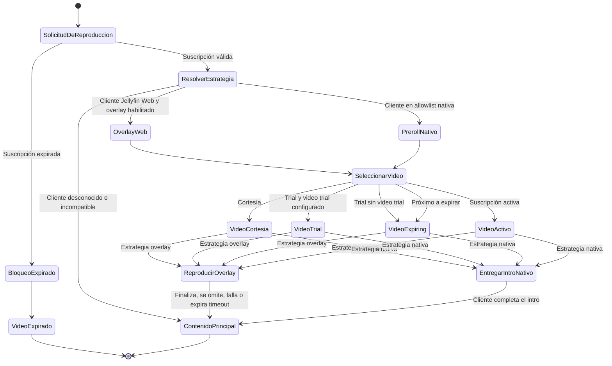

# Plan de Robustez para Prerolls

## Objetivo

Mostrar videos de suscripción antes del contenido sin reemplazar, bloquear, repetir ni alterar la fuente principal para usuarios con suscripción activa, próxima a expirar o de cortesía.

Los usuarios expirados usan un flujo independiente: el contenido se bloquea y se reproduce el video de expiración configurado.

## Orden de Estrategias

La estrategia se selecciona con la información de sesión: cliente, dispositivo, versión de aplicación y tipo de contenido.

1. **Overlay de video — preferido**
   - Aplicable sólo a Jellyfin Web compatible con la extensión de EasyMovie.
   - El contenido original se mantiene cargado y pausado.
   - El intro se reproduce en un elemento `<video>` temporal superpuesto.
   - La capa no muestra controles estándar; presenta únicamente el botón **Omitir intro**.
   - Al terminar, omitir o fallar el intro, se elimina la capa y se reanuda el contenido original.
   - No se cambia la fuente ni la cola interna del reproductor principal.

2. **Preroll nativo de Jellyfin**
   - Aplicable sólo a clientes validados para encadenar correctamente intro y contenido.
   - EasyMovie devuelve el intro mediante `IIntroProvider`.
   - El cliente controla la reproducción secuencial del intro y del item solicitado.

3. **Fallback seguro: omitir intro**
   - Aplicable a clientes desconocidos, incompatibles o sin una estrategia validada.
   - EasyMovie no devuelve un intro y Jellyfin inicia el contenido solicitado directamente.
   - Se prioriza no interrumpir la reproducción sobre mostrar el video de suscripción.

```text
¿El usuario está expirado?
  Sí → bloquear contenido y reproducir el video de expiración
  No →
    ¿Jellyfin Web soporta el overlay?
      Sí → reproducir overlay con botón único "Omitir intro"
      No →
        ¿El cliente está validado para IIntroProvider?
          Sí → usar preroll nativo
          No → omitir intro y reproducir el contenido
```

## Requisitos de Implementación

1. Añadir logs estructurados con el item original, intro seleccionado, estado de suscripción, sesión, cliente, dispositivo, versión y estrategia elegida.
2. Implementar una política configurable de compatibilidad para clientes con overlay y clientes compatibles con prerolls nativos.
3. Restringir `SubscriptionIntroProvider` a sesiones autorizadas para la estrategia de preroll nativo.
4. Mantener estado temporal por sesión para impedir solicitudes repetidas, bucles intro → intro y reintentos después de un fallo.
5. Implementar el overlay de Jellyfin Web con una única acción **Omitir intro** y recuperación automática cuando el intro termina o falla.
6. Validar que el intro exista, sea legible y reproducible antes de entregarlo.
7. No modificar la fuente ni la cola de reproducción principal para usuarios no expirados.
8. Tratar errores de streams remotos, incluidos los de Gelato/ffprobe, como fallos de la fuente principal y no como motivo para reiniciar el intro.

## Cobertura de Pruebas

Pruebas automatizadas:

- Usuario activo con cliente compatible con overlay.
- Usuario activo con cliente compatible con `IIntroProvider`.
- Cliente incompatible o desconocido: no se devuelve intro y el contenido continúa.
- Video de intro inexistente o inválido: el contenido continúa.
- Solicitudes repetidas en la misma sesión: se entrega como máximo un intro.
- Un intro de EasyMovie nunca recibe otro intro.
- Usuario expirado: se conserva el reemplazo por el video de expiración.

Pruebas manuales de regresión:

| Cliente | Película | Episodio | Stream Gelato | Resultado esperado |
| --- | --- | --- | --- | --- |
| Jellyfin Web | Sí | Sí | Sí | Overlay, botón único y reanudación del contenido |
| Jellyfin Android | Sí | Sí | Sí | Preroll nativo sólo si está validado; si no, contenido directo |
| Jellyfin Android TV | Sí | Sí | Sí | Sin loops ni sustitución accidental |
| Cliente externo | Sí | Sí | Sí | Contenido directo si no existe compatibilidad conocida |

## Despliegue Gradual

1. Implementar logs, política de compatibilidad y fallback seguro.
2. Validar el preroll nativo por cliente y versión.
3. Implementar y probar el overlay en Jellyfin Web.
4. Habilitar el overlay únicamente para las versiones confirmadas.
5. Ampliar la lista de compatibilidad a partir de pruebas de regresión exitosas.

## Hallazgos del Entorno Desplegado

- Jellyfin Server usa la imagen base `jellyfin/jellyfin:10.11.11`.
- El Dockerfile reemplaza el cliente web incluido por el fork privado `git@gitlab.com:gcachuo/jellyfin-web.git`, clonado en `/jellyfin/jellyfin-web` durante el build.
- El checkout presente en el contenedor Jellyfin corresponde al commit corto `fe3b3f7`.
- JavaScript Injector 3.5.0.0 y File Transformation 2.5.11.0 están instalados. La integración de EasyMovie utiliza JavaScript Injector y no modifica directamente `index.html`.
- El bundle de Jellyfin Web declara `ApiClient.getIntros(itemId)`, `ApiClient.getUrl(...)` y `ApiClient.accessToken()`. El overlay usa estas APIs para consultar la decisión del servidor y reproducir el intro sin cambiar la fuente ni la cola del contenido principal.
- El servidor Jellyfin 10.11.11 usa los claims `Jellyfin-UserId` y `Jellyfin-Client`, y resuelve los `IntroInfo.ItemId` devueltos por proveedores a items `Video` antes de responder al cliente.
- `Jellyfin Web` es el identificador para el overlay. Incluye navegador, Android Phone y WebOS cuando usan el cliente web. Android TV se identifica como `Jellyfin Android TV` y Roku debe añadirse sólo después de confirmar su `ClientName` real en los logs.

## Máquina de Estados de Preroll


